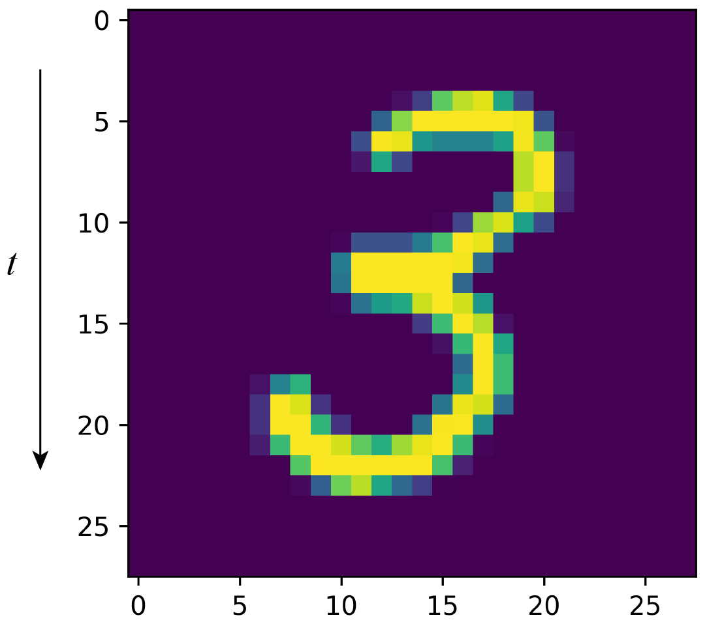

# Markov Recurrent Neural Networks

This repository is the PyTorch implementation of [Markov Recurrent Neural Networks](https://github.com/NCTUMLlab/Che-Yu-Kuo-MarkovRNN.git) with two temporal datasets as quick demonstration.

## Architecture
**Paper**:(https://ieeexplore.ieee.org/document/8517074)

## Dataset

[UCF101](http://crcv.ucf.edu/data/UCF101.php) has total 13,320 videos from 101 actions. Videos have various time lengths (frames) and different 2d image size; the shortest is 28 frames. 

### Prerequisites
- [Python 3.6](https://www.python.org/)
- [Jupyter notebook](https://jupyter.org/)
- [PyTorch 1.0](https://pytorch.org/)
- [Numpy 1.15.0](http://www.numpy.org/)
- [Sklearn 0.20.2](https://scikit-learn.org/stable/)
- [Matplotlib](https://matplotlib.org/)