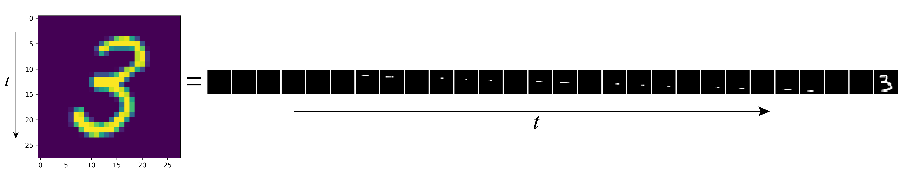
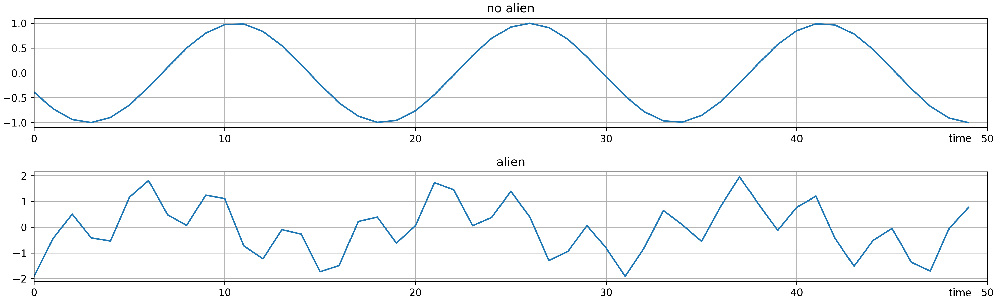
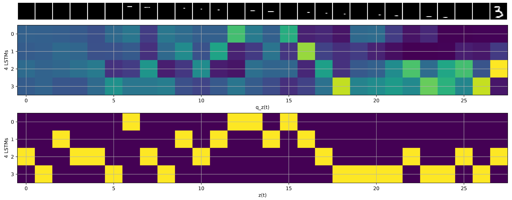
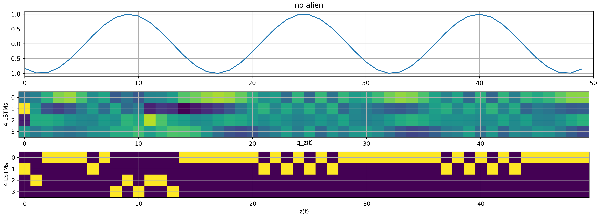
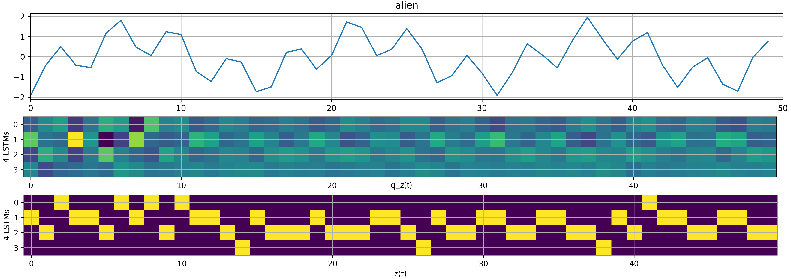

# Markov Recurrent Neural Networks

This repository is the PyTorch implementation of [Markov Recurrent Neural Networks](https://github.com/NCTUMLlab/Che-Yu-Kuo-MarkovRNN.git) with two temporal datasets as quick demonstration.

## Architecture
- **Paper**: [Markov Recurrent Neural Networks (MRNN)](https://ieeexplore.ieee.org/document/8517074)


- **Heuristic explanation**:
MRNN is built as a deep learning model for time series, such as NLP, weather, and stock price prediction. The main idea is to create several *parallel* [RNNs](https://en.wikipedia.org/wiki/Recurrent_neural_network) [(LSTMs)](http://colah.github.io/posts/2015-08-Understanding-LSTMs/) to learn the time dependence of the data simultaneously. If data has complex temporal structures (behaviour), single RNN may not be enough to carry out the pattern. *k* parallel RNNs (*k=1,2,3,...*) read same input signal at the same time, each learns different character of data. Then another latent variable *z* (also trained by networks) will determine when and which LSTM should be listened for attaining learning task. The choosing mechanism by *z* itself is a process stochastic modeling of transitions between *k* LSTMs based on Markov property, and hence the name MRNN.


## Datasets

- [**MNIST**](https://en.wikipedia.org/wiki/MNIST_database) viewed in series as sequential input:


- **Artificial alien signals**: I am imagining we are able to recognize radio signals sent by aliens from the sky such as [SETI](https://setiathome.berkeley.edu/), where I generated two kinds of wave forms for Markov RNN to distinguish:



## Prerequisites
- [Python 3.6](https://www.python.org/)
- [Jupyter notebook](https://jupyter.org/)
- [PyTorch 1.0](https://pytorch.org/)
- [Numpy 1.15.0](http://www.numpy.org/)
- [Sklearn 0.20.2](https://scikit-learn.org/stable/)
- [Matplotlib](https://matplotlib.org/)


## Usage
No installation required except the prerequisites. File `kLSTM.py` contains all the modules needed for running Markov RNN. Two examples are provided in Jupyter notebook formats:
```
MRNN_MNIST.ipynb
MRNN_detect_alien_signal.ipynb
```

## Results & Interpretations
1. Take *k=4* for MNIST. 

- In figure of *q_z(t)*, the horizontal axis is time, vertical axis shows which LSTM to look. The color palette indicates the probability of the LSTM being used. 

- In figure of *z(t)*, the yellow color indicates which LSTM was actually used by Gumbel softmax sampling.



- Over all probability of which LSTM being chosen


- Take *k=4* for alien signal (binary) classification
- **Non-alien signal**


- **alien signal**
Over all probability of choosing each LSTM



## Improvements
I extended the code in Pytorch such that the Markov RNN can have more than 1 hidden layers, where it was restricted to 1 hidden layer in the original code of [Tensorflow version](https://github.com/NCTUMLlab/Che-Yu-Kuo-MarkovRNN.git).